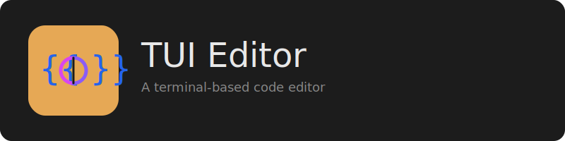

# Only Code

A lightweight terminal-based code editor built with Python and Textual.

## Philosophy

The name "Only Code" carries three intentional meanings:
1. **"Only code"** - A minimalist editor focused solely on writing code
2. **"Only in the terminal"** - No GUI, runs anywhere with a terminal
3. **"Only what you need"** - Essential features without bloat

## Features

### Core Editing
- Syntax highlighting for 15+ languages (Python, JavaScript, Rust, Go, HTML, CSS, JSON, YAML, and more)
- Multi-file editing with tabs
- Line numbers
- Auto-indent on Enter
- Configurable indent width (2/4/8 spaces) and type (spaces/tabs)
- Soft wrap toggle

### Interface
- **File Browser** (Ctrl+B) - Navigate project files, switch between home/root/project directories
- **Terminal Panel** (Ctrl+J) - Run shell commands without leaving the editor
- **Tab Bar** - Quick switching between open files
- **Status Bar** - Current file, line/column position, language
- **Command Palette** (Ctrl+P) - Quick access to all commands and settings

### Theming
- Multiple UI themes (dark and light)
- Syntax themes auto-match UI theme
- Manual syntax theme override available

## Installation

### Prerequisites
- Python 3.10+
- A terminal with good Unicode support

### Setup

```bash
# Clone or navigate to the project directory
cd Only_Code

# Run the setup script
./setup.sh

# Start the editor
./run.sh
```

### Manual Setup

```bash
python3 -m venv venv
source venv/bin/activate
pip install -r requirements.txt
python -m onlycode.main
```

## Building Standalone Executable

Create a distributable binary that doesn't require Python:

```bash
# Install PyInstaller
pip install pyinstaller

# Build
python build.py

# Output in dist/OnlyCode/
./dist/OnlyCode/OnlyCode
```

Build options:
- `python build.py --clean` - Clean previous builds first
- `python build.py --onefile` - Single executable file
- `python build.py --package` - Create distributable archive

## Keyboard Shortcuts

### File Operations
| Shortcut | Action |
|----------|--------|
| Ctrl+O | Open file |
| Ctrl+S | Save file |
| Ctrl+T | New tab |
| Ctrl+W | Close tab |

### Navigation
| Shortcut | Action |
|----------|--------|
| Ctrl+B | Toggle file browser |
| Ctrl+J | Toggle terminal |
| Ctrl+PageDown | Next tab |
| Ctrl+PageUp | Previous tab |
| Alt+1-9 | Jump to tab 1-9 |
| Escape | Focus editor |

### Command Palette
| Shortcut | Action |
|----------|--------|
| Ctrl+P | Open command palette |

Use the command palette to access:
- UI and syntax themes
- Editor settings (indent width, tabs/spaces, soft wrap, auto-indent)
- File browser root switching
- All available commands

## Requirements

- Python 3.10+
- textual[syntax] >= 0.40.0
- watchfiles >= 0.20.0

## License

MIT License

Copyright (c) 2025 Chuck Finch - Fragillidae Software

## Documentation

- [User Guide](USER-GUIDE.md) - Complete usage documentation
- [dev_docs/](dev_docs/) - Development documentation and changelogs

